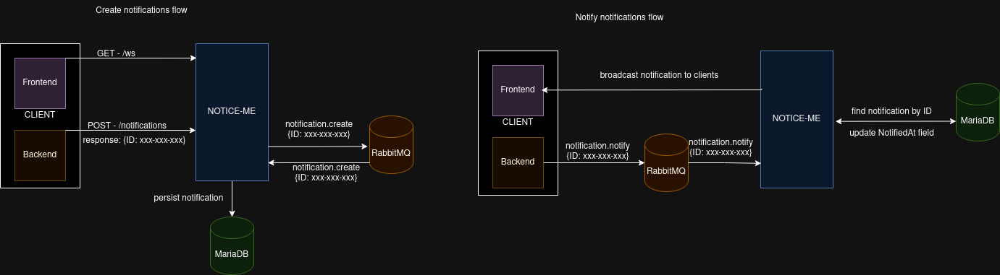

# Notice-Me

demo site: https://demo.notice-me.es

Notice-Me is a microservice that allows you to implement 
frontend async notifications from your backend system/s via websockets.

The value added by this project is mostly in the backend since the frontend implementation is not a lot more than a 
websocket connection but a frontend package to simplify the integration would be considered if needed.

Create notifications from frontend or other backend service and notify to all clients available.
You can also discriminate by client id or group id.

## Installation

Thanks to embed package Notice-Me is prepared to be deployed as a single binary. 
Clone project, configure, build and deploy!

```shell
git clone git@github.com:vicent-dev/notice-me.git && 
cp notice-me/static/config.example.yaml notice-me/static/config.yaml &&
make build
```

The configuration file `config.yaml` is very simple, just change access directives for RabbitMQ and MariaDb and you are ready to go.

```yaml
server:
  host: 127.0.0.1 # change with your domain 
  port: 8080 
  cors: ["localhost"] # change with domains allowed
  env: "dev" # change this to prod to enable ssl encryption
  tlsKey: "" # add ssl files
  tlsCert: ""
db:
  user: root # change user, password, port and host
  pwd: root
  port: 3306
  host: mariadb
  name: notice_me_server
rabbit:
  user: guest # change user, password, port and host
  pwd: guest
  port: 5672
  host: rabbit
  consumersCount: 1 # change this if you want more than one consumer per queue
...
```

This repository provides to you `docker-compose.yaml` in root folder to easily deploy the required services for Notice-Me but feel free 
to install those in the way you want. Furthermore, you will find a systemd config file `notice-me.service` to easily deploy Notice-Me in your VPS.

## Use cases

This would be a very basic data flow with Notice-Me:

### Create notifications flow
- frontend client/s connects to Notice-Me websocket.
- user does something in your system that will trigger eventually a notification. (e.g. complex import process of data that will probably take some time to finish).
- POST to notification to schedule the notification creation. ID is generated by Notice-Me so you can store the reference for the recently sent create notification.
- notification is published into `notification.create` RabbitMQ queue.
- notification is created when Notice-Me consumes message from `notification.create` queue.

### Notify notifications flow
- eventually your system will finish your process related with the notification  (e.g. all the data is finally imported in your system).
- publish from your system into queue `notification.notify` with the notification ID that you will receive from create endpoint.
- Notice-Me will consume that message and broadcast that notification to all fronted clients that matches the configured criteria.



## EntryPoints

There is two basic ways to interact with Notice-Me:

- **http**: endpoints are for the websocket connection and for the CRUD of notifications (swagger documentation pending).
- **amqp**: one consumer for `notification.notify` queue which objective is to notify a notification and marked it as notified.
